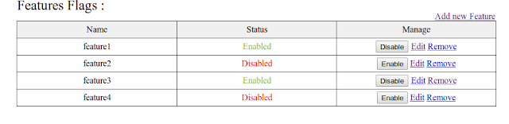
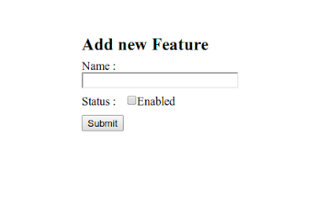

Manage features in Rails application with feature_flags
You must have faced situation while developing to turn off/on some features in your rails application. 

So here is ruby gem feature_flags that provides this functionality.Using this we can maintain different features in rails application.
So to add gem in your Rails application,
Add this line to your application’s Gemfile:
```ruby
gem 'feature_flags'
```
then run command
```bash
rails generate feature_flags:install
```
this will generate 3 files,
1) initializer file in config/initializer/feature_flags.rb
2) migration file for Feature model
3) Feature.rb
also it add routes in your rails application
```ruby
resources :features
```
 then do
```ruby
rake db:migrate
```
In feature_flags.rb initializer file you can mention which layout to use for view
```ruby
FeatureFlags.configure do |config|
  config.layout = "application" 
end
```

```ruby
FeatureFlags.enabled?(:feature_name) To check whether feature is enabled or not 

FeatureFlags.enable_all                   To enable all features in your app.

FeatureFlags.disable_all                  To disable all features in your app.

FeatureFlags.set_disabled(:feature_name)  To disable feature in your app.

FeatureFlags.create_and_enable(:feature_name)  To create and enable feature

FeatureFlags.enable(feature_name)         To enable feature
```
If you want to generate views then use,
```bash
rails generate feature_flags:views
```
It will also solve branching problem in rails application, as we merge branches having different features and then solving conflicts in it.so feature_flags makes it easy, you just turn on/off that feature in app.
for example,
```ruby
if FeatureFlags.enabled?(:feature_name1)
   # your code for feature_name1
end
```

Here are some screenshots, 
main index view( /feature_flags )



Adding new feature page,


