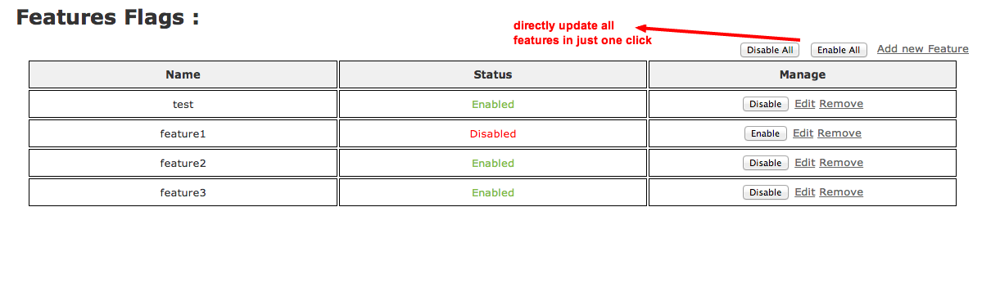

Back again with new features in ruby gem feature_flags (0.1.0).
Here is my blog post on old version of feature_flags.

I recommend to go through it first if you haven't, to know more features available in this gem.

Memoization of features is the main change in this version and it really improved performance. Its much more fast now,

What's new  ????

1)  Added Memoization:
In previous versions, Everytime it fires sql query to check whether particular feature is enabled or not when we check
```ruby
FeatureFlags.enabled?(:feature_name)
```

worrying about that ???? Now you need not to because it will fire sql query only when there are changes into database, and memoise it, and that optimizes it to great extent.

2) Check for multiple features at a time:
There may be situation when you need to check following scenario with multiple features,
```ruby
if FeatureFlags.enabled?(:feature_name1) && FeatureFlags.enabled?(:feature_name2) && FeatureFlags.enabled?(:feature_name3)
  ## some code
else
  ## some code
end
```
 which really increases your code, So now you can do it in better ways
```ruby
if FeatureFlags.enabled?([:feature_name1, :feature_name2, :feature_name3])
   ## some code
end
```
So when you have more than one features to check simultaneously, pass them as array of feature names
but if you have single feature to check then just write
```ruby
if FeatureFlags.enabled?(:feature_name)
  ## some code
end
```
3) Another feature is that you can check if any of given features are active or not:
```ruby
if FeatureFlags.enabled_any?([:feature_name1, :feature_name2, :feature_name3])
   ## some code
end
```
this will execute code inside if any of [:feature_name1, :feature_name2, :feature_name3] feature is active

4) UI changes:
  Do everything on single page (add, edit, enable, disable, remove)


If you are already using previous versions(<= 0.0.3) and want to migrate to this version (0.1.0) then, after updating gem version
just add following line to your model
  include FeatureFlags::FeatureBase
and generate views again..if you have already generated for new updated view
rails generate feature_flags:views
thats it n you are done.  :)

Here is demo [http://feature-flags.herokuapp.com/](http://feature-flags.herokuapp.com/)