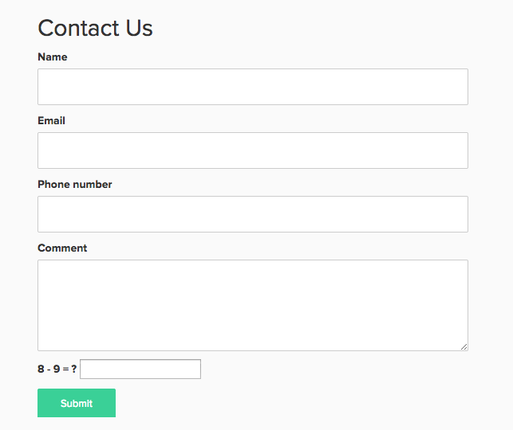

When your application has a form that's available to everyone for eg. Contact us, you will be spammed! So what can we do about it? 

Well, one option is to have all forms secured by authentication... OR we can use a captcha. So, Here is how you can implement your own simple captcha in Ruby on Rails,

First of all we will create Captcha class in lib folder,
```ruby title="captcha.rb"
class Captcha
  attr_accessor :operand1, :operand2, :operator

  def initialize
    @operand1 = (1..10).to_a.sample
    @operand2 = (1..10).to_a.sample
    @operator = [:+, :*, :-].sample  
  end

  def initialize_from(secret)
    yml = YAML.load(Base64.decode64(secret))
    @operand1, @operand2, @operator = yml[:operand1], yml[:operand2], yml[:operator]
  end

  def correct?(value)
    result == value.to_i
  end

  def encrypt
  	Base64.encode64 to_yaml
  end

  def self.decrypt(secret)
    result = new
    result.initialize_from secret
    result
  end

  def to_yaml
    YAML::dump({
      :operand1 => @operand1,
      :operand2 => @operand2,
      :operator => @operator
    })
  end

  def question
    "#{@operand1} #{@operator.to_s} #{@operand2} = ?"
  end

  private

  def result
    @operand1.send @operator, @operand2
  end
end
```

Here we are dumping the variables into a string using YAML and then encrypt/decrypt.

Then in your Controller,

```ruby
class ContactsController < ApplicationController

  def new
    @captcha = Captcha.new
  end

  def create
    @captcha = Captcha.decrypt(params[:captcha_secret])

    unless @captcha.correct?(params[:captcha])
      flash.now[:alert] = "Please make sure you entered correct value for captcha."
      # Here we need to initialize @captcha with new object in order to show 
      # different captcha each time on form 
      @captcha = Captcha.new
      render :new
    else
      ContactsMailer.notify(contact).deliver
      flash[:notice] = "Your message has been sent successfully"
      redirect_to root_path
    end
  end
end
```
In your view,
```erb
<div class="field">
  <%= hidden_field_tag :captcha_secret, @captcha.encrypt %>
  <%= label_tag :captcha, @captcha.question %>
  <%= text_field_tag :captcha, "" %>
</div>
```
That's it. And it will look similar to this,


